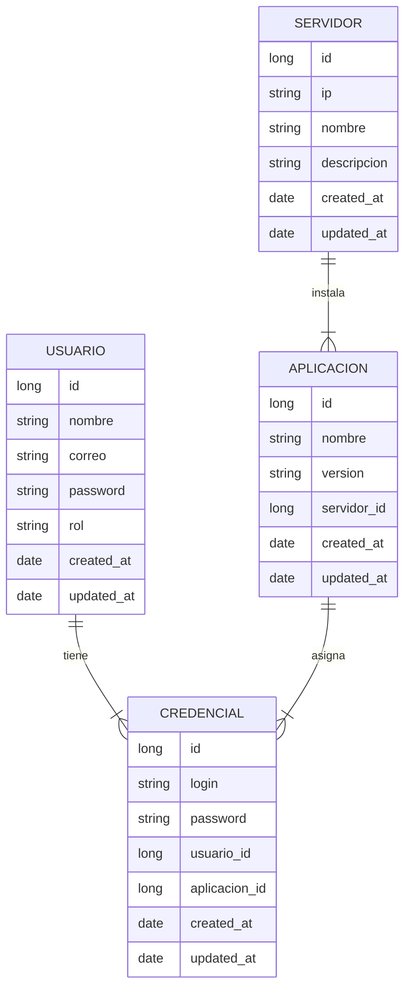

# API Para Administración de password en Aplicaciones v2.0
### Bedu Java SE
### Descripción
El proyecto tiene como finalidad el desarrollo de un API rest para llevar el control de la asignación de credenciales (usuario y contraseña) de las apliaciones instaladas en un servidor. Dichas credenciales son asignadas a un usuario para su acceso al servidor y/o aplicación. Ej. un servidor A tiene instalado Glassfish Server y SSH, cada aplicación tiene su usuario y contraseña de acceso que serán asignados al usuario X.

### Objetivo
Aplicar los conocimientos adquiridos en el modulo de Springboot  y Java del curso de Bedu.

- JPA
- Validations
- Lombok
- Security (Authorization, Authentication)
- Testing

### Diagrama E-R

### Rutas de cada recurso
| Recurso |verbo HTTP  |	Ruta |
|--|--|--|
| Servidor |  GET| /servidores |
|  |GET  | /servidor/{id} |
|  |POST | /servidor |
|  |PUT  |/servidor/{id}  |
|  |DELETE  | /servidor/{id} |
| Usuario | GET |/usuarios  |
|  |GET  | /usuario/{id} |
|  |POST | /usuario |
|  |PUT  | /usuario/{id} |
|  |DELETE  | /usuario/{id} |
| Aplicacion | GET  | /servidor/{servidorId}/aplicaciones |
|  |GET  | /servidor/{servidorId}/aplicacion/{id} |
|  |POST | /servidor/{servidorId}/aplicacion |
|  |PUT  | /servidor/{servidorId}/aplicacion/{id} |
|  |DELETE  | /servidor/{servidorId}/aplicacion/{id} |
| Credencial | GET | /usuario/{usuarioId}/credenciales |
|  |GET  | /usuario/{usuarioId}/credencial/{id} |
|  |POST | /usuario/{usuarioId}/aplicacion/{aplicacionId}/credencial |
|  |PUT  | /usuario/{usuarioId}/aplicacion/{aplicacionId}/credencial/{id} |
|  |DELETE  | /usuario/{usuarioId}/credencial/{id} |

### Video de explicación

https://youtu.be/_WYGm6itK-I
